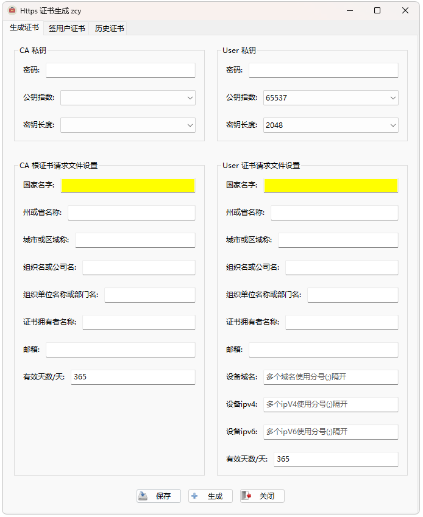
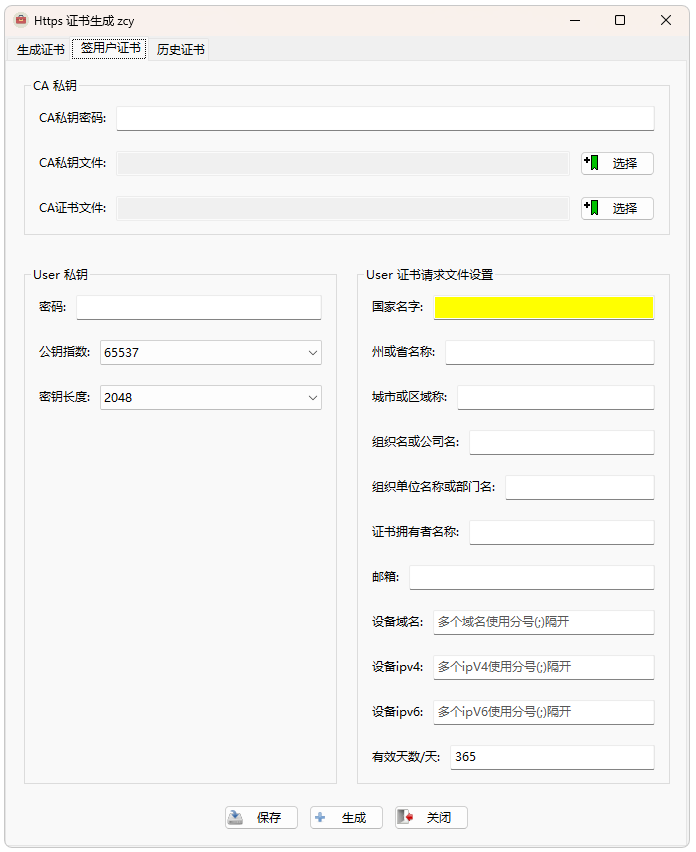

## 1.应用：模仿CA机构签发简洁https证书，可用于内网测试的https证书使用

## 2.技术栈 :  python3.9.10 (tags/v3.9.10:f2f3f53, Jan 17 2022, 15:14:21) [MSC v.1929 64 bit (AMD64)] on win32

## 		      cryptography，wxpython，Re

## 3.预览

###  	(1)page1: 生成证书，填写CA信息与待签用户证书信息

### 	(2)page2: ，通过选择的CA证书和私钥对用户证书进行签名

### 	(3)page3: 生成的历史证书，可以快速打开

## 4. 导入环境包:  pip install -r requirements.txt

## 5 .软件打包命令: pyinstaller --onefile --windowed --version-file=file_verison_info.txt --name=Https签发证书 --icon=icon.ico main.py

## 6.软件直接使用: Https签发证书.exe

